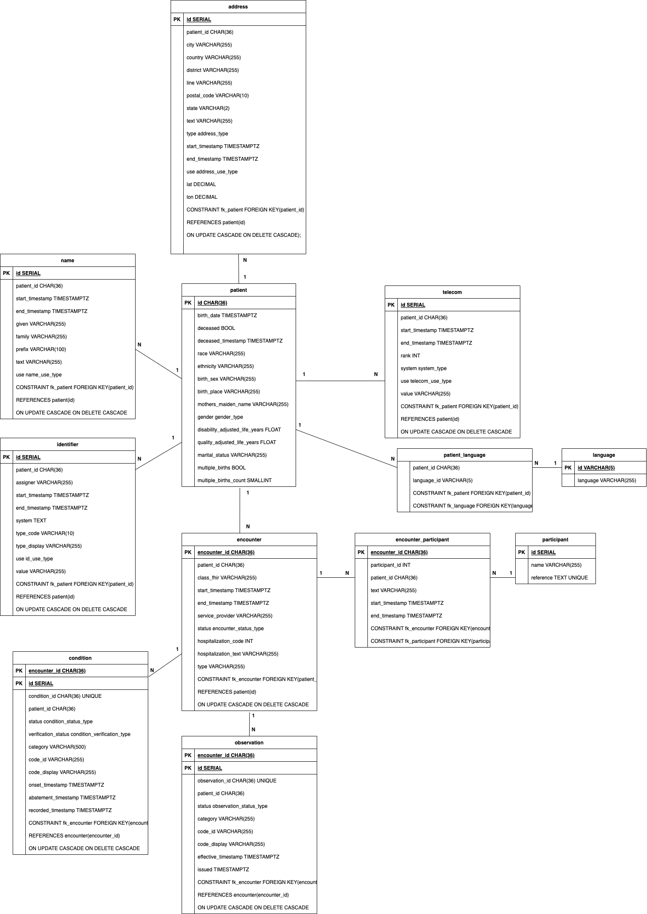

## How to run the import
1. Clone the repo
2. Set the environment variables needed
```
export DB_NAME="postgres"
export USER_NAME="postgres"
export PASSWORD="somepassword"
```
3. run `docker compose up` ond optionally add -d to run in the background

This will pull a postgres docker image and run the file that creates postgres tables and the file that starts the import from the data folder (inside of src folder). This process is not very fast, it might take a minute or in the logs it should print "Import finished" when finished.

To check the files, a UI can be installed (for postgres eg pgadmin 4 can be used) and it can be connected to localhost at port 5432 where authentication is the user name and password set from step 1. An alternative is to do it programmatically. `PostgresUtils` from `postgres_utils.py` can be used to connect to the server, then execute SQL query commands to check for table existence or query them. Examples of how it's being done can be found in the integration test folder. 

## How to run tests
1. Make sure that the docker container from the above is still running.

An alternative is to run just a postgres server image seperately. The tests are meant to be run on a local server to avoid interfering with any other datbases. Make sure that this server is running on localhost and that environment where requirements have been installed is set up.

2. cd into src folder
3. Set the environment variables needed
```
export IS_AUTOMATED_TEST=true
export USER_NAME=postgres
export PASSWORD=somepassword
```

If the `IS_AUTOMATED_TEST` vairiable is used for integration tests. If it is not set, the tests won't be run. Since the tests are creating and droping a databse, it's being used as a safety measure to ensure these tests are being run on the local server.

4. Run unit tests `python -m pytest tests/unit`
5. Run integration tests
```
python -m pytest tests/integration/test_create_tables.py
python -m pytest tests/integration/test_file_importer.py
```


## Current work and future work
### Objects imported
This solution is importing some but not all fhir objects provided in the sample data files. It's currently importing patient, observation, encounter and condition objects. In the future the support for the rest of the objects should be built.

The current ERD is shown below


Similarily some decisions on desired information display should be made. For example, currently the `birth place` for a patient is displayed as follows "Amherst, Massachusetts, US". If it was found that some analyses needed to be carried out on locations, it might be better to create a seperate table for locations. Then seperate out all levels of it. Eg. have a seperate row for Amherst where type is city and parent id would be id of Massachusetts, another row for Massachusetts where type is state and parent id of US.

### Speed
The current import is running at a speed of O(nm) where n is the amount of files in the data folder and m is the amount of entities in each bundle. This is not very fast.

To improve the speed, the future work could create a server that holds information on which files have been imported and which ones have not. Then this server could be used to coordinate mutiple file imports in parallel. The `file_importer.py` file should have a modification to get a filename that needs importing and continue running while server has files marked as unimported.

Another thing to try would be threading inside of The `file_importer.py`. Each bundle could be run as a separate thread.